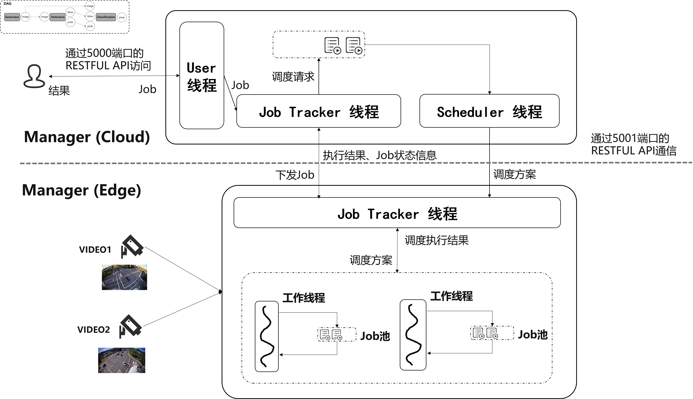

# video-dag-manager (no-render)

## （1）大致结构

`job_tracker.py`运行后是单进程多线程的，其线程模型如下图所示（目前只有一个工作线程，详见main函数部分）。用户通过/user/submit_job接口针对视频流下发任务，任务被下发到特定的边缘节点后，在边缘节点为任务生成Job对象，然后确定Job执行计划（以下称为“调度”）、根据调度结果执行Job，一段时间后Job可以被重新调度：



三类线程通过Manager类统一管理：

- app线程：对外提供服务，如用户提交任务、查询视频流信息等，相关接口定义见`job_tracker.py`中app.route
- scheduler线程：负责执行调度器模块，其调度函数可替换
- 工作线程：一个工作线程模拟一个CPU核，负责若干个已生成执行计划的Job的执行。目前只有一个工作线程

Manager类：负责管理所有工作线程的Job的状态与执行状态，工作线程需要通过Manager获取一个已确定执行计划的Job来执行。Manager同时提供app线程以对外提供服务。

Job类：记录了DAG作业的执行状态机：调度计划、最后一次DAG执行的各个步骤结果、Job当前状态等

Job状态主要有三类

- UNSCHED：未生成调度计划
- EXEC：已生成调度计划，可供CPU调度执行
- DONE：终止，可能是执行完毕，也可能是执行过程中有报错

## （2）启动方式

版本要求：

- （1）为了开启http的KeepAlive：Werkzeug<=2.0.0，Flask<=2.0.0，Flask-Cors<=2.0.0
- （2）为了运行预加载模型：pytorch==1.13.0，torchvision==0.14.0，对应版本的cuda和cudnn等
- （3）其余依赖可依据报错安装

伪分布式启动：

```shell
# 先启动query_manager（监听5000端口），后启动job_manager（监听5001端口，并通过5001端口与query_manager通信）
# 注意：在项目根目录下新建input/目录存放数据视频————input.mov、input1.mp4、traffic-720p.mp4
$ python3 service_demo.py
$ python3 query_manager.py
$ python3 job_manager.py

# 使用如下命令，方便在文件中查询error日志
$ python3 job_manager.py 2>&1 | tee demo.log
```

分布式启动：

```shell
# 注意：修改service_demo.py中的"cloud"的ip为边端可访问的云端ip
cloud$ python3 service_demo.py
# --serv_cloud_addr指定请求计算服务的ip和端口
cloud$ python3 query_manager.py \
               --serv_cloud_addr=114.212.81.11:5500

# 注意：service_demo.py的修改与cloud的文件保持一致
edge$ python3 service_demo.py
# 参数说明：
#   --query_addr指明边端接入点（注册视频流信息、汇报结果、接收调度结果）
# 注意：
#   在项目根目录下新建input/目录存放数据视频————input.mov、input1.mp4、traffic-720p.mp4
edge$ python3 job_manager.py \
              --query_addr=114.212.81.11:5000 \
              --serv_cloud_addr=114.212.81.11:5500
```

## （3）服务接口示例

```js
描述：提供D计算服务
接口：POST :5500/service/face_detection
输入
{
    "image": "\x003\x001..."
}
输出
{
    "faces": ["\x003\x001...", ...],  // 检测出来的人脸图像
    "bbox": [[1,2,3,4], [1,2,3,4], ...],
    "prob": []
}

描述：提供C计算服务
接口：POST :5500/service/face_alignment
输入
{
    "faces": ["\x003\x001...", ...],  // 需要做姿态估计的人脸图像
    "bbox": [[1,2,3,4], [1,2,3,4], ...],
    "prob": []
}
输出
{
    "count_result": {  // 可以显示的数值结果
        "up": 6,
        "total": 8
    }
}
```

## （4）相关用户接口

```js
描述：获取接入到云端的节点信息
接口：GET :5000/node/get_video_info
返回结果
{
    "192.168.56.102:7000": {
        "0": {
            "type": "traffic flow"
        },
        "1": {
            "type": "people indoor"
        }
    },
    "192.168.56.102:8000": {
        "0": {
            "type": "traffic flow"
        },
        "1": {
            "type": "people indoor"
        }
    }
}

描述：从云端接收用户提交的任务
接口：POST :5000/query/submit_query
请求数据：
{
    "node_addr": "192.168.56.102:7000",
    "video_id": 1,
    "pipeline": ["face_detection", "face_alignment"],
    "user_constraint": {
        "delay": 0.8,
        "accuracy": 0.9
    }
}

描述：从云端获取指定任务的结果
接口：GET :5000/query/get_result/<query_id>
{
    "result": {
        // 该部分是列表，代表最近10帧的处理结果
        "appended_result": [
            {
                "#no_helmet": 1,
                "n_loop": 11
            },
            {
                "#no_helmet": 1,
                "n_loop": 12
            },
            {
                "#no_helmet": 1,
                "n_loop": 13
            },
            ...
        ],

        // 该部分是json，代表最近一次调度的调度策略和调度结果
        "latest_result": {
            // 当前调度执行计划
            "plan": {
                "flow_mapping": {
                    "face_detection": {
                        "model_id": 0,
                        "node_ip": "192.168.56.102",
                        "node_role": "host"  // node_role有三种可能：host、edge、cloud，前端只区分cloud和非cloud，非cloud显示为“边端”
                    },
                    "face_alignment": {
                        "model_id": 0,
                        "node_ip": "192.168.56.102",
                        "node_role": "cloud"
                    }
                },
                "video_conf": {
                    "encoder": "H264",
                    "fps": 24,
                    "resolution": "360p"
                }
            },
            // 最近一次调度后，DAG执行各步骤的平均结果
            "plan_result": {
                "delay": {
                    "face_detection": 0.35737492098952783,
                    "face_alignment": 0.35737492098952783
                }
            }
        }
    },
    "status": 0
}


描述：从特定节点获取渲染的图片结果
接口：GET :5100/user/video/<job_uid>
返回数据：流式jpeg图片响应，直接放入img标签可显示
```

## （5）其他内部接口（用户无关）

```js
描述：指定节点提交任务，该接口在本地为job生成实例，每个job一个线程。主线程轮询任务集，若发现一个新启动的job收到了下发的调度策略，则为该job分配线程并启动。
接口：POST `:5001/node/submit_job`

{
    "node_addr": "192.168.56.102:7000",
    "video_id": 1,
    "pipeline": ["face_detection", "face_alignment"],
    "user_constraint": {
        "delay": 0.8,
        "accuracy": 0.9
    }
}

```

## （6）调度器函数接口

云端集中调度，所以需要有通信接口

```js
描述：请求云端调度。云端收到请求后，将包装成scheduler_func需要的输入，传入云端scheduler线程队列（unsched_job_q）。scheduler线程完成调度后，请求对应节点的/node/update_plan接口
接口：POST: 5001/node/get_plan
请求数据：
{
    "job_uid":
    "dag":
    "last_plan_result":
    "user_constraint"
}

描述：云端调度器主动请求，以更新边端的调度计划。边端响应该接口时，将往job_dict[job_uid]中更新执行计划，并设置job为可执行的（JOB_STATE_EXEC）
接口：POST: 5001/node/update_plan
请求数据：
{
    "job_uid":
    "video_conf":
    "flow_mapping":
}
```

调度器应封装为一个函数，决定视频流分析配置、并将DAG Job中的dag.flow的各个任务映射到节点。

函数参数：

（1）待映射/调度的DAG Job

- 参考`POST :5000/user/submit_job`端口的`dag`字段

```js
"dag" = {
    "generator": "SingleFrameGenerator",
    "flow": ["SingleFrameGenerator", "face_detection", "face_alignment"],
    "input": {
        "face_detection": {
            "image": "SingleFrameGenerator.image"
        },
        "face_alignment": {
            "image": "SingleFrameGenerator.image",
            "bbox": "face_detection.bbox",
            "prob": "face_detection.prob"
        }
    }
}
```

（2）DAG的输入数据信息（暂不考虑）

- 参考“数据生成器”的返回数据（如，SingleFrameGenerator）
- 也可以是基于对本次调度的数据流的数据评估信息（如图片复杂度、图片数据大小）

```js
generator_output = {
    "seq":
    "image":
}
```

（3）资源和服务情况

- 各机器CPU、内存、GPU情况
- 各机器服务的请求地址
- 当前节点与其余节点的上行带宽/下行带宽

```js
// TBD
resource_info = {
    "192.168.56.102": {
        "face_detection": {
            "n_process": 1,
            "cpu_ratio": 0.8,
            "mem_ratio": 0.4
        },
        "face_alignment": {
            "n_process": 1,
            "cpu_ratio": 0.8,
            "mem_ratio": 0.4
        }
    },
    "114.212.81.11": {
        "face_detection": {
            "n_process": 1,
            "cpu_ratio": 0.8,
            "mem_ratio": 0.4
        },
        "face_alignment": {
            "n_process": 1,
            "cpu_ratio": 0.8,
            "mem_ratio": 0.4
        }
    },
}
```

（4）上一轮调度方案的执行结果（若上一轮调度包含多帧，则取各帧数值结果的平均）

- 一帧图像经过DAG推理的总时延

```js
last_plan_res = {
    "delay": {
        "face_detection": 20,
        "face_alignment": 0.5
    },
    "iou": {
        "face_detection"
    },
    "mae": {
        "face_alignment"
    }
}

last_plan_res = {
    "face_detection": {
        "iou": 20,
        "delay"
    },
    "face_alignment": {
        "mae": 20,
        "delay"
    },
}
```

（5）用户约束

- 时延范围
- 精度反馈

```js
user_constraint = {
    "delay": [-1, 50],
    "acc_level": 5,  // 用户给出的精度评级：0~5精确等级递增
}
```

函数返回：

（1）视频配置

- 分辨率
- 跳帧率/fps
- 编码方式

```js
video_conf = {
    "face_detection": {
        "resolution": "480p",
        "fps": 30,
        "encoder": "H264",
    },
    "face_alignment": {
        "resolution": "480p",
        "fps": 30,
        "encoder": "H264",
    }
}
```

（2）DAG执行策略

- 字典中的key需要与传入的DAG Job中`flow`各字段匹配

```js
flow_mapping = {
    "face_detection": {
        "model_id": 0,  // 大模型、中模型、小模型
        "node_role": "host",  //放到本地执行
        "node_ip": "192.168.56.102",  // 映射的节点
    },
    "face_alignment": {
        "model_id": 0,
        "node_role":  "cloud",  // 放到云端执行
        "node_ip": "114.212.81.11",
    }
}
```
